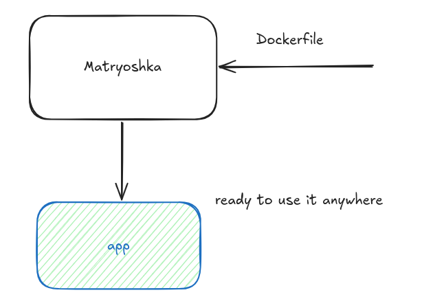

# Matryoshka
Matryoshka is a self-contained, daemonless container runtime, this means that the Runtime and the Image are bundled in one single executable, so you can plug and play without need to install or configure any dependencies



## How it works:

the first component is **Matryoshka** itself, it is the main engine that is responsible for taking _Dockerfile_ and _docker-compose_ files and transforms them into an application bundle that is ready to use

> later on we will be making more changes on matryoshka to support other orchestrators.

for example a 

```cmd
mtrska build -src ./project-folder -o ./matryoshka-app -fname myapp
```

this command will take the project folder and transform it into a matryoshka bundle, and save it as an executable file 

to run your containerized __system__ you can simply run anywhere on any machine without any dependencies 

```cmd
./matryoshka-app
```

>  when we say "any machine without any dependencies", we mean it Literally, no need to install docker engine, no need to install any runtime, but make sure that first you use your desired `rootfs` first in the Dockerfiles, or simple use `FROM scratch` if you know what you're doing


